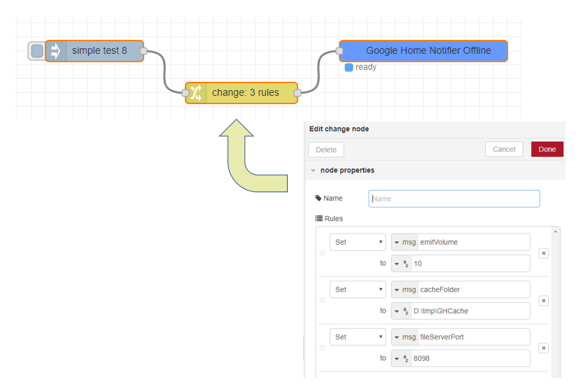

# node-red-contrib-google-home-notifier-offline

This node is forked from:
<a href="https://github.com/nabbl/node-red-contrib-google-home-notify">node-red-contrib-google-home-notify</a>

Notifications sent to google home assistant usually request for each notification an internet connection.
This connection is needed because the notification text is sent to google-tts server (https://translate.google.com/) in order to obtain a link to an mp3 file having the notification text.
Then google assistant is then requested to play this mp3 file from the internet.

For me this was an issue especially for notification about security (e.g. garage door is open). It was not acceptable to have external dependencies like the availability of the internet connection and hoping google-tts has not changed/updated his api.
Thus for me raised the need for offline notifications that run locally without external dependencies.

This is why "node-red-contrib-google-home-notifier-offline" emerged.

How to use:

Notification text you send can be updated with:

1) **emitVolume** : value 0 up to 100, this is the notification volume. The initial volume level is restored after the notification. The default level is 20%.

2) **cacheFolder** :  this can be any folder on the machine. If the cache folder is set, the notifiation will be played always from cache. 
If the file is not in cache, the node will request the mp3 file from google-tts and save it to the local cache folder.

3) **fileServerPort** : this has only to be set if you have already an listener on the default port 8081.

