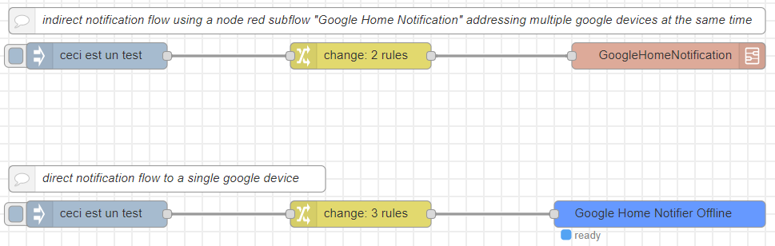
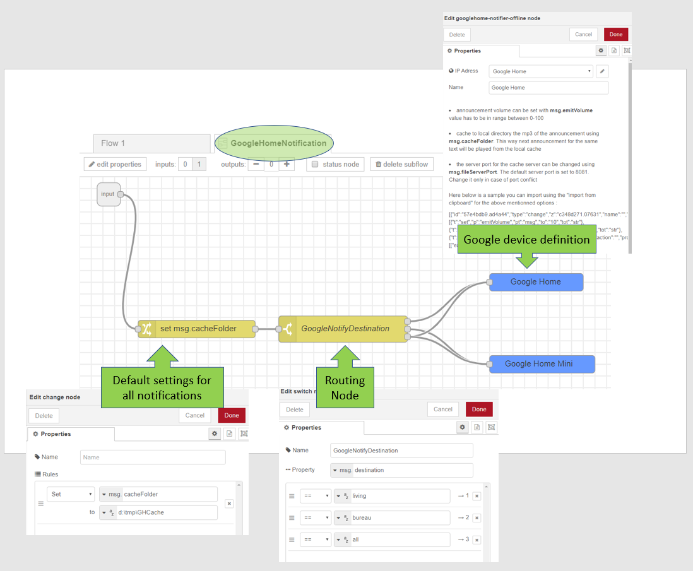

## node-red-contrib-google-home-notifier-offline


# replaced by [node-red-google-notify](https://flows.nodered.org/node/node-red-google-notify).


**version 1.1.0:**
fix: google tts doesn't support speed anymore. Have to choose value 1 for normal speed or less than 1 for slow.
!Important: a cache folder has to be setup.

**version 0.1.5:**
fix: url to play from localserver on linux host

**version 0.1.3:**
url for local server fix on google-home-notifier-offline

**version 0.1.2:**
dependency fix´

**version 0.1.1:**
The reading speed can now be set with the message variable 'speed'. eg. "msg.speed".
Value must be between 0.01 (slowest) and 1 (normal speed).

**version 0.1.0:**
Documentation updated

**version 0.0.6:**
**fix:** when casting to multiple devices, restoring devices inital volume level didn't work, thus all the devices remained at the announcement volume level.

This node is forked from:
<a href="https://github.com/nabbl/node-red-contrib-google-home-notify">node-red-contrib-google-home-notify</a>

Notifications sent to google home assistant usually request for each notification an internet connection.
This connection is needed because the notification text is sent to google-tts server (https://translate.google.com/) in order to get a link to an mp3 file having the notification text.
Then google assistant is requested to play this mp3 file from the internet.

~~For me this was an issue especially for notification about security (e.g. garage door is open). It was not acceptable to have external dependencies like the availability of the internet connection and hoping google-tts has not changed/updated his api.
Thus for me raised the need for offline notifications that run locally without external dependencies. 
This is why "node-red-contrib-google-home-notifier-offline" emerged.~~

**important:**<br>
**offline** refers to the announcement text being played from a local folder, but you still need an internet connection for casting to your google device, this is due to the google casting architecture.

***How to use:***

Notification text you send can be updated with:

1) **emitVolume** : value 0 up to 100, this is the notification volume. The initial volume level is restored after the notification. The default level is 20%.

2) **cacheFolder** :  this can be any folder on the machine. If the cache folder is set, the notifiation will be played always from cache. 
If the file is not in cache, the node will request the mp3 file from google-tts and save it to the local cache folder.

3) **fileServerPort** : this has only to be set if you have already an listener on the default port 8081.


It's possible to point a single google device or a group of google devices using a node-red subflow (see figure here below)



(copy & paste in node-red using import from clipboard)
``` js
[{"id":"2a4252c0.5c4fce","type":"subflow","name":"GoogleHomeNotification","info":"","in":[{"x":50,"y":30,"wires":[{"id":"2e760d93.791962"}]}],"out":[]},{"id":"5ae262d6.e988ac","type":"switch","z":"2a4252c0.5c4fce","name":"GoogleNotifyDestination","property":"destination","propertyType":"msg","rules":[{"t":"eq","v":"living","vt":"str"},{"t":"eq","v":"bureau","vt":"str"},{"t":"eq","v":"all","vt":"str"}],"checkall":"true","repair":false,"outputs":3,"x":450,"y":260,"wires":[["d4c7c0cb.b476e"],["33e2797c.5b5606"],["d4c7c0cb.b476e","33e2797c.5b5606"]],"outputLabels":["Google Home","Google Home mini",""]},{"id":"d4c7c0cb.b476e","type":"googlehome-notifier-offline","z":"2a4252c0.5c4fce","server":"da212a5d.597b08","name":"Google Home","x":800,"y":180,"wires":[]},{"id":"33e2797c.5b5606","type":"googlehome-notifier-offline","z":"2a4252c0.5c4fce","server":"ebe165de.892128","name":"Google Home Mini","x":790,"y":320,"wires":[]},{"id":"2e760d93.791962","type":"change","z":"2a4252c0.5c4fce","name":"","rules":[{"t":"set","p":"cacheFolder","pt":"msg","to":"d:\\tmp\\GHCache","tot":"str"}],"action":"","property":"","from":"","to":"","reg":false,"x":200,"y":260,"wires":[["5ae262d6.e988ac"]]},{"id":"da212a5d.597b08","type":"googlehome-config-node-offline","z":"2a4252c0.5c4fce","ipaddress":"192.168.20.194","name":"Google Home","language":"fr"},{"id":"ebe165de.892128","type":"googlehome-config-node-offline","z":"2a4252c0.5c4fce","ipaddress":"192.168.20.197","name":"Google Home Mini","language":"fr"},{"id":"3f60aa46.aa4026","type":"subflow:2a4252c0.5c4fce","z":"c348d271.07631","name":"","env":[],"x":910,"y":360,"wires":[]},{"id":"8c73b93b.3db918","type":"change","z":"c348d271.07631","name":"","rules":[{"t":"set","p":"destination","pt":"msg","to":"all","tot":"str"},{"t":"set","p":"emitVolume","pt":"msg","to":"50","tot":"str"}],"action":"","property":"","from":"","to":"","reg":false,"x":560,"y":360,"wires":[["3f60aa46.aa4026"]]},{"id":"fb06ce90.3001b","type":"inject","z":"c348d271.07631","name":"","topic":"","payload":"ceci est un test","payloadType":"str","repeat":"","crontab":"","once":false,"onceDelay":0.1,"x":260,"y":360,"wires":[["8c73b93b.3db918"]]},{"id":"4a281a.8a2917e8","type":"inject","z":"c348d271.07631","name":"","topic":"","payload":"ceci est un test","payloadType":"str","repeat":"","crontab":"","once":false,"onceDelay":0.1,"x":260,"y":540,"wires":[["ccef16e8.5ee2d8"]]},{"id":"ccef16e8.5ee2d8","type":"change","z":"c348d271.07631","name":"","rules":[{"t":"set","p":"emitVolume","pt":"msg","to":"50","tot":"str"},{"t":"set","p":"cacheFolder","pt":"msg","to":"D:\\tmp\\GHCache","tot":"str"},{"t":"set","p":"fileServerPort","pt":"msg","to":"8098","tot":"str"}],"action":"","property":"","from":"","to":"","reg":false,"x":560,"y":540,"wires":[["429d4f1d.2d91c"]]},{"id":"429d4f1d.2d91c","type":"googlehome-notifier-offline","z":"c348d271.07631","server":"b8b08a71.387228","name":"","x":900,"y":540,"wires":[]},{"id":"9f10712d.fc031","type":"comment","z":"c348d271.07631","name":"direct notification flow to a single google device","info":"","x":340,"y":500,"wires":[]},{"id":"1a676c3c.0a0bc4","type":"comment","z":"c348d271.07631","name":"indirect notification flow using a node red subflow \"Google Home Notification\" addressing multiple google devices at the same time","info":"","x":590,"y":320,"wires":[]},{"id":"b8b08a71.387228","type":"googlehome-config-node-offline","z":"","ipaddress":"192.168.20.194","name":"","language":"fr"}]
```

Inside of the "GoogleHomeNotification" subflow:


